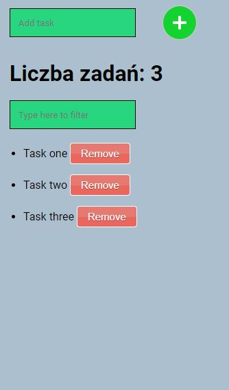

# Simple to do list
> In this repository we have simple to do list. We can add tasks to our list and then it is possible to remove them or filter by content.

## Screenshots

## Technologies
* HTML
* CSS
* JavaScript
* GIT

## Status
Project is: done

## Inspiration
Project inspired on task from *Samuraj Programowania* course on Udemy.

## Contact
Created by [Damian Jackiewicz](https://www.linkedin.com/in/damian-jackiewicz/) - feel free to contact me!
